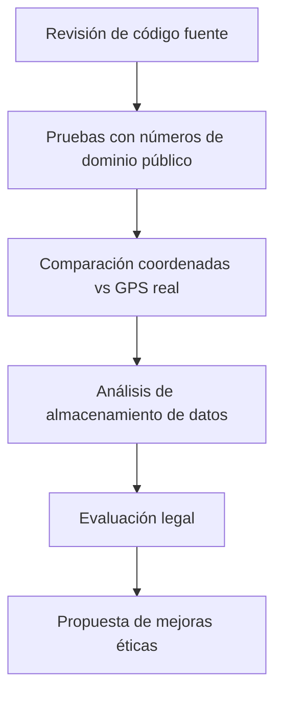

# Evaluación Técnica: NumerosintMX

### Validador Telefónico con Geolocalización para México

[](LICENSE)
[](https://osintframework.com/)
[](https://numerosintmx.foroactivo.com)

---

## 🔍 Descripción del Proyecto

Este repositorio documenta el análisis completo de **NumerosintMX**, una herramienta OSINT de código abierto diseñada para validar números telefónicos mexicanos, identificar operadores (Telcel, AT&T, Movistar, VoIP) y estimar su ubicación geográfica aproximada.

**Investigador responsable:** AvaStrOficial  
**Versión del protocolo:** 1.0.0  
**Fecha del análisis:** 26 de mayo de 2026  
**Sitio oficial:** [https://numerosintmx.foroactivo.com](https://numerosintmx.foroactivo.com)  
**Repositorio original:** [github.com/AvastrOficial/numerosintmx](https://github.com/AvastrOficial/numerosintmx)

---

## 🎯 Justificación del Análisis

Entender las capacidades y limitaciones de herramientas OSINT como **NumerosintMX** es crucial para:

| Colectivo | Importancia |
|-----------|-------------|
| 🛡️ **Usuarios defensivos** | Saber qué información pueden filtrar sus números personales. |
| 👨‍💻 **Desarrolladores** | Mejorar validadores similares aplicando privacidad por diseño. |
| ⚖️ **Autoridades** | Detectar posibles usos indebidos (acoso, doxeo, fraude). |
| 🌍 **Comunidad OSINT ética** | Establecer buenas prácticas al usar APIs de geolocalización. |

---

## ❓ Planteamiento del Problema

Actualmente, cuando alguien recibe una llamada o mensaje de un número desconocido en México, **no tiene forma fácil de saber**:

- 📍 ¿De qué estado o ciudad llama?
- 🏠📱 ¿Es un número fijo (casa/negocio) o móvil (celular)?
- 📡 ¿Pertenece a un operador legítimo (Telcel, AT&T, Movistar) o es un número VoIP sospechoso?

**NumerosintMX resuelve:** Dar esa información automática en segundos, sin buscar manualmente en páginas de directorio o redes sociales.

---

## 🎯 Objetivos

### Objetivo General
Analizar el funcionamiento, precisión y riesgos de la herramienta **numerosintMX** como validador telefónico con capacidades de geolocalización.

### Objetivos Específicos
1. Revisar el código fuente (JavaScript, HTML, CSS) para entender el flujo de llamadas a APIs y manejo de datos.
2. Evaluar la precisión de la geolocalización comparando resultados de numerosintMX con coordenadas reales (GPS) de números de prueba.
3. Identificar qué datos personales son obtenidos y si se almacenan local o externamente.
4. Analizar la legalidad del uso de TimeZoneDB y OpenStreetMap para derivar ubicación desde un número telefónico.
5. Proponer mejoras éticas: anonimización, limitación de consultas o advertencias al usuario sobre riesgos de fraude o acoso.

---

## ⚖️ Marco Legal Aplicable (México)

### Ley Olimpia (Violencia Digital)

| Concepto | Detalle |
|----------|---------|
| **Fundamento** | Reformas a la Ley General de Acceso de las Mujeres a una Vida Libre de Violencia y al Código Penal Federal (arts. 199 Quáter, 199 Quinquies, 269 Ter, 269 Quater) |
| **Regula** | Violencia digital contra mujeres: difusión íntima sin consentimiento, acoso digital, perfiles falsos. |
| **Relevancia** | Si NumerosintMX se usa para localizar, acosar o intimidar a una persona, podría configurar violencia digital. |
| **Sanciones** | De 3 a 6 años de prisión y multas económicas. |

---

## 🧪 Hipótesis de Investigación

| Hipótesis | Descripción |
|-----------|-------------|
| **H1 - Precisión baja** | La ubicación será a nivel ciudad o región, dependiendo de la calidad de los datos registrados en OpenStreetMap (calles nuevas pueden estar pendientes de actualización). |
| **H2 - Almacenamiento limitado** | El script no almacena datos persistentemente, pero las APIs externas (TimeZoneDB, OpenStreetMap) sí podrían registrar las consultas. |
| **H3 - Riesgo normativo** | El uso de numerosintMX sin consentimiento del titular del número podría violar normativas de protección de datos en México (LFPDPPP). |

---

## 🧬 Tipo de Investigación

| Tipo | Enfoque | Método |
|------|---------|--------|
| **Mixta** | Cuantitativo | Precisión de coordenadas vs. GPS real |
| | Cualitativo | Revisión de código fuente y análisis legal |

---

## 🧭 Metodología


## 🔧 Stack Tecnológico Analizado
Frontend: JavaScript, HTML5, CSS3

### APIs externas:
- TimeZoneDB (derivación de zona horaria → ubicación)
- OpenStreetMap / Nominatim (geocodificación inversa)
- Posibles bases de datos: No identificadas en cliente (las consultas pueden quedar solo en APIs externas)

## ✅ Consideraciones Éticas y Legales del Análisis
Este estudio se realiza bajo los siguientes principios:

No se consultarán números reales de personas sin su consentimiento explícito.

Solo se usarán números de prueba:

- Dominio público
- Códigos ficticios (ej. +52 123 456 7890)
- Números proporcionados por servicios de prueba.
- Los resultados se reportarán de forma agregada sin exponer números específicos.
- Se respetarán los términos de uso de:
- OpenStreetMap (atribución obligatoria)
- TimeZoneDB

Divulgación responsable: Si se detecta una vulnerabilidad de privacidad, se notificará al autor (AvastrOficial) antes de cualquier divulgación pública.

---

## 📁 Estructura del Repositorio
```html
numerosintmx-analysis/
│
├── docs/                 # Documentación completa del análisis
│   ├── technical-review.md
│   ├── gps-accuracy-test.csv
│   └── legal-framework.md
│
├── src/                  # Scripts de prueba (si aplica)
│   └── test-validator.js
│
├── results/              # Resultados agregados del estudio
│   └── privacy-report.pdf
│
├── README.md             # Este archivo
└── LICENSE               # Licencia CC BY-NC-SA 4.0
```

---

## 📢 Advertencia de Uso ⚠️ NumerosintMX es una herramienta educativa OSINT.
- El uso de esta herramienta para acosar, doxear, intimidar o realizar fraudes telefónicos puede constituir un delito grave en México, incluyendo sanciones bajo la Ley Olimpia y la Ley Federal de Protección de Datos Personales.

- Este repositorio no respalda ni promueve el uso indebido de la herramienta.

# ⭐ ¿Te interesa la seguridad telefónica y el OSINT ético en México?
· Dale ⭐ a este repo y contribuye con propuestas o mejoras.
